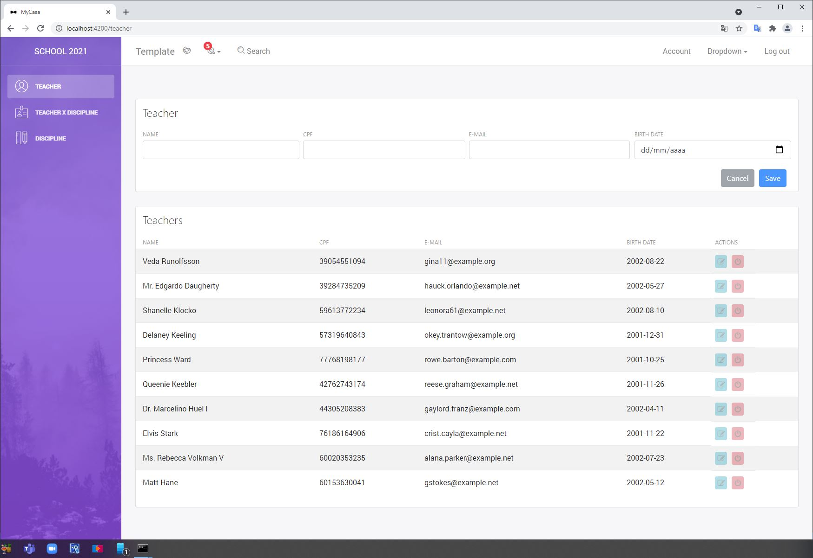
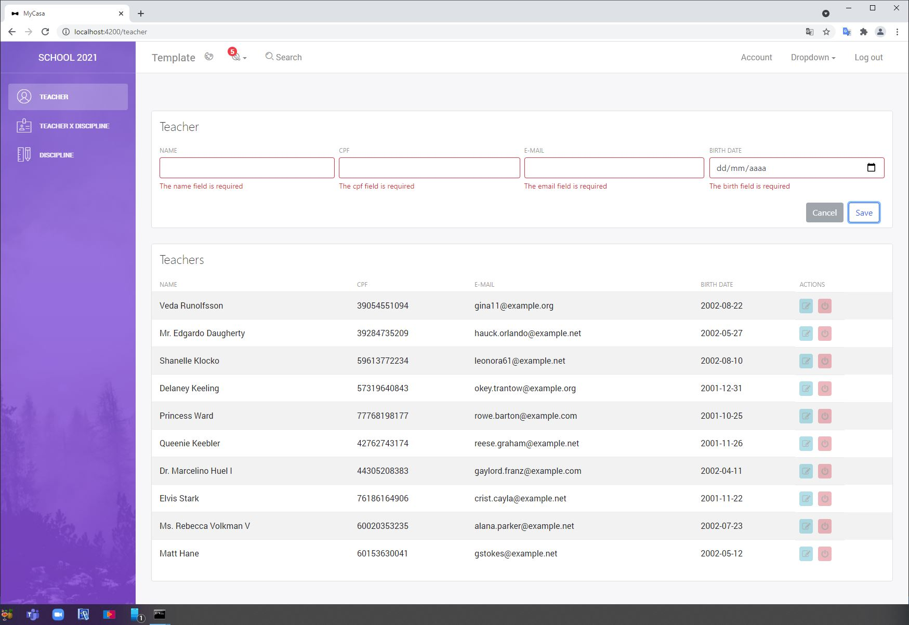
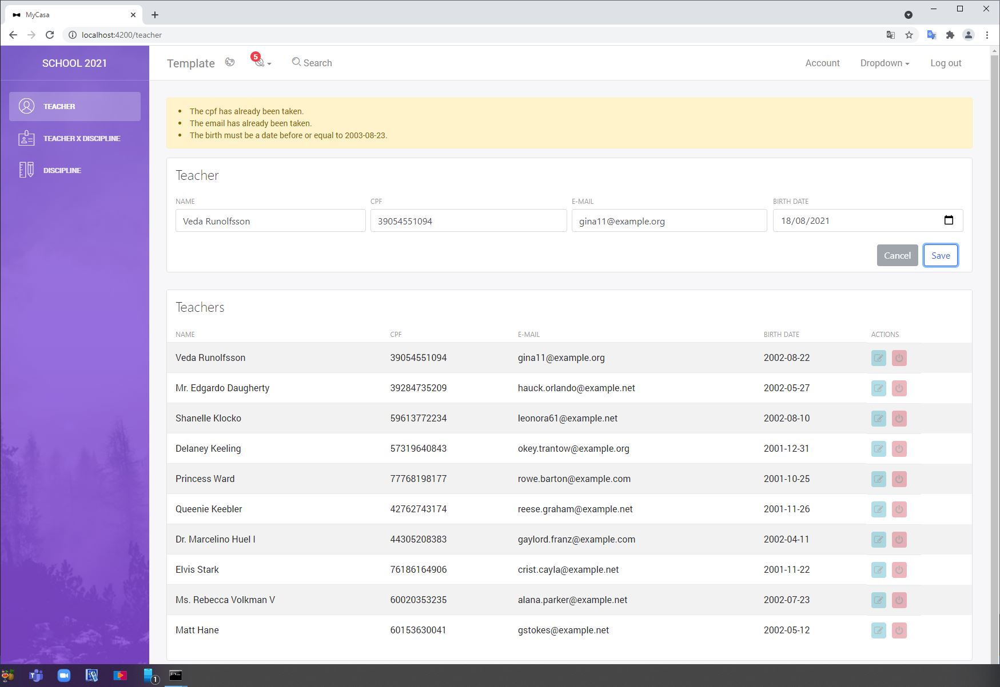
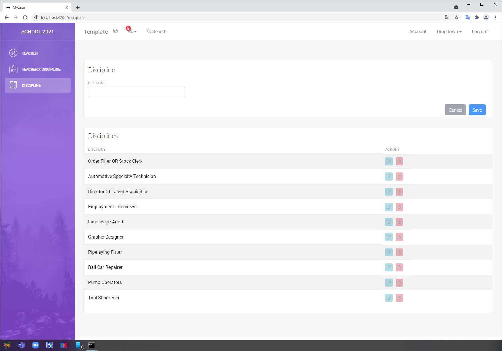
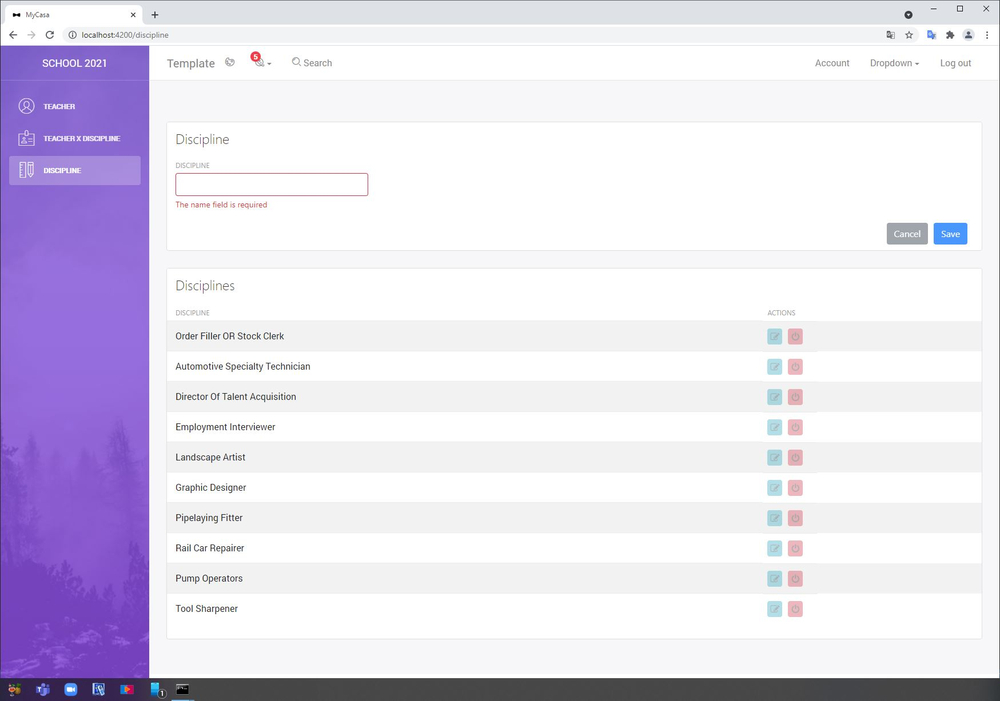
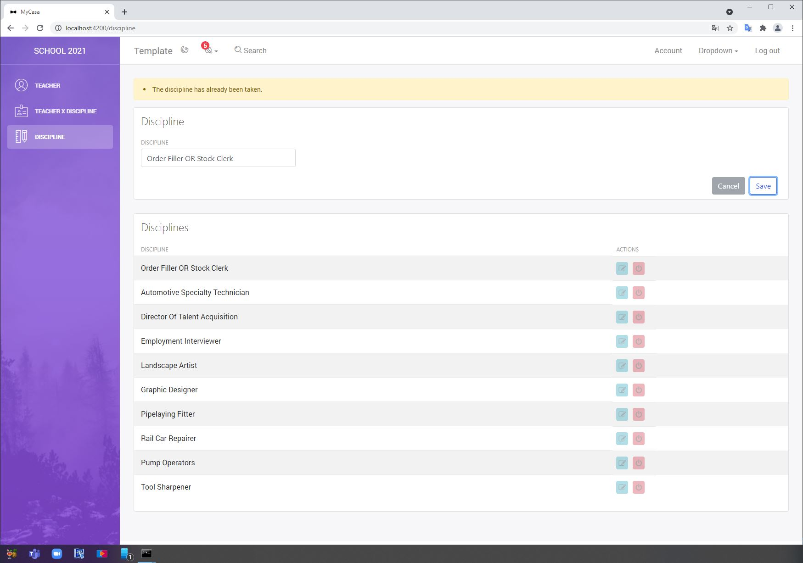
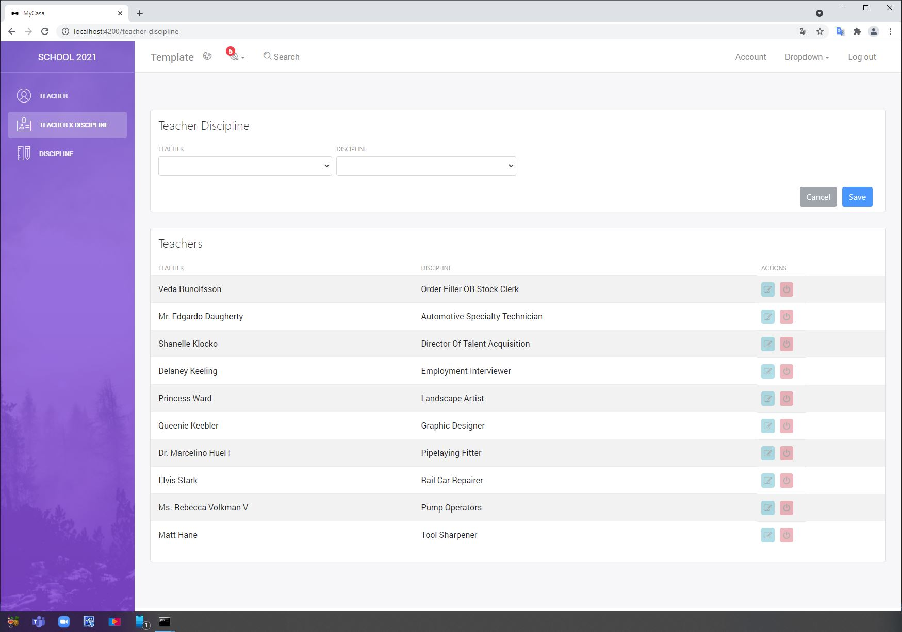
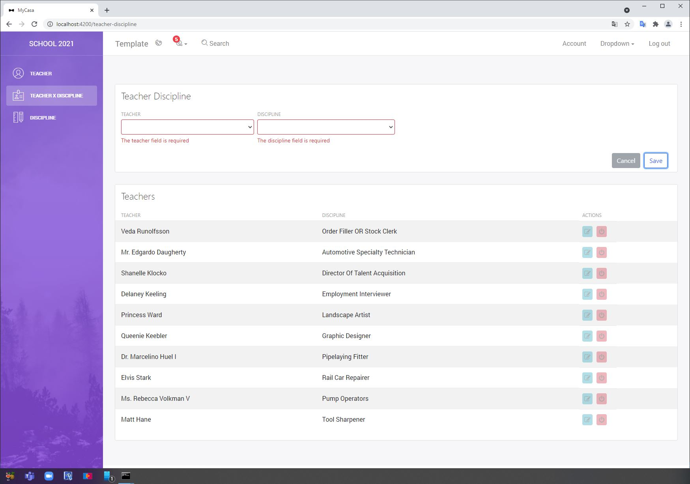

# Teacher-web

This project was generated with [Angular CLI](https://github.com/angular/angular-cli) version 11.2.12.

### Install Dependencies 
```
npm install --save-dev @angular-devkit/build-angular
```

## Run development server
```
ng serve
```

## Open browser
```
Navigate to `http://localhost:4200/`.
```

## How it works

This app is using Angular Framework. It's a very simple app. There is no auth or CSRF protection. APP uses the bootstrap for the layout.

The app is separated in 7 components:

- A parent discipline <app-discipline> with the discipline form. It will check form fields by default. If it is foreced the backend will take care of it.
- A parent teacher <app-teacher> with the teacher form. It will check form fields by default. If it is foreced the backend will take care of it.
- A parent teacher discipline <app-teacher-discipline> to link the teacher from discipline. It will check form fields by default. If it is foreced the backend will take care of it.

- A child messaging <app-notifications> tha's only thake care of the Success message and Errors messages.
- A child sidebar <app-sidebar> that's just taking care of the api's menu.
- A child footer <app-footer> that's just layout footer.
- A child navbar <app-navbar> that's just layout navbar.
  
- A service layer responsible for api calls

## Screens


### 1. Form Teacher


### 2. Form Teacher Errors


### 3. Form Teacher Errors -  Serve PHP


### 4. Form Disciplines


### 5. Form Disciplines Errors


### 6. Form Disciplines Errors -  Serve PHP

  
### 7. Form Teacher Disciplines

  
### 8. Form Teacher Disciplines Errors

  
### 9. Form Teacher Disciplines Errors -  Serve PHP


